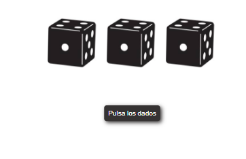
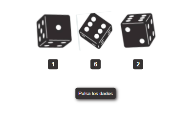
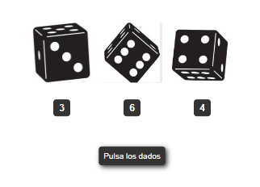

# Ejercicio de Angular dados

## Tecnologías usadas: Angular, scss, html
He creado un proyecto Angular llamado dados con un componente llamado dado que se llama en el componente app principal.
## Descripción: 
### Inicio de la página en el primer renderizado: 

### Vista de la página al pulsar el botón:
Al pulsar el botón Pulsar los datos se ejecuta un evento onClick y se calculan números random en función de un límite fijado que es 3 porque tenemos 3 dados. This.isClick es una variable booleana que cuando pulsamos el botón se pone a true y vuelve a ponerse false al terminar la animación con el evento onanimationend; esta variable controla que se ejecute la animación de movimiento del dado siempre que pulsemos el botón.
Cuando pulsamos el botón se ejecuta la animación y se muestran los tres dados con los números aleatorios calculados.

